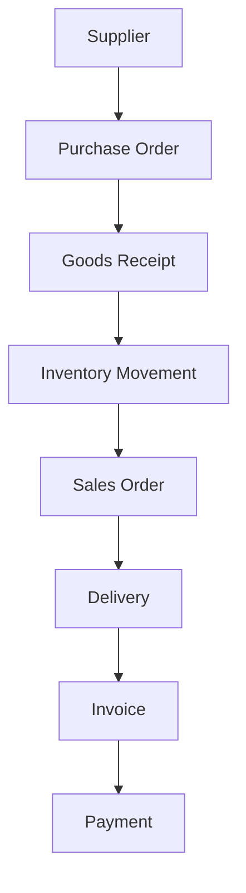
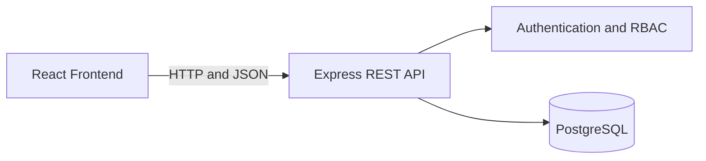

# Supply Flow: Supplier Management System


Supply Flow is a full-stack, web-based Supplier Management System designed to centralize and digitize interconnected business operations—from purchasing and inventory to sales, delivery, invoicing, and payments.

This repository is a personal portfolio and learning project. It is currently under active development and is not yet intended for production use.

## Project Overview

Many operational processes are still managed through separate spreadsheets, documents, and manual records. This can cause duplicated data, inconsistent updates, limited traceability, and delays when teams need information from other departments.

Supply Flow is being developed to organize these workflows within one integrated system. It connects master data, transactions, inventory movements, and financial records so each role can work with relevant and structured information.

### Main objectives

- Centralize supplier, product, customer, and transaction data.
- Connect purchasing, warehouse, sales, delivery, and finance workflows.
- Reduce repetitive and fragmented manual data entry.
- Improve stock and transaction traceability.
- Control system access based on user roles.
- Provide a structured foundation for operational reports and dashboards.

## Development Status

| Area | Current status |
| --- | --- |
| Database schema and business relationships | Implemented |
| Backend REST API and core business modules | MVP implemented |
| JWT authentication and role-based access control | Implemented |
| Automated backend testing | Implemented and passing for covered workflows |
| Frontend dashboard and core module interfaces | In active development |
| Full frontend-to-backend workflow integration | In active development |
| Production deployment and live demo | Planned |
| Project documentation and screenshots | In progress |

> The status above will be updated as development progresses.

## Business Workflow



The workflow begins when goods are ordered from a supplier. Received quantities create inventory records, while outgoing sales and deliveries reduce stock. Completed sales can then continue to invoice and payment tracking.

## Main Modules

### Authentication and user management

- User login with JSON Web Token authentication.
- Role-based access control for protected endpoints and features.
- Current-user profile and user management.
- Audit identity for selected business records.

### Master data

- Suppliers
- Product categories
- Products and SKU data
- Customers
- Users and roles

### Purchasing

- Purchase orders and purchase-order items
- Purchase-order status transitions
- Expected receipt dates
- Goods receipts and received quantities

### Warehouse and inventory

- Inventory movements
- Stock-in records from goods receipts
- Stock-out records related to business transactions
- Movement history, dates, notes, and audit information
- Low-stock data foundation

### Sales and delivery

- Sales orders and sales-order items
- Sales-order status transitions
- Customer delivery information
- Deliveries and delivered quantities

### Finance

- Invoices
- Payment records
- Invoice and payment status tracking
- Outstanding-invoice data foundation

### Dashboard and operational data

- Role-based navigation
- Summary information for operational monitoring
- Search, filtering, and reusable pagination on data pages
- Responsive interfaces for different screen sizes

## User Roles

| Role | Main responsibility |
| --- | --- |
| `ADMIN` | Manages users, master data, and overall system access. |
| `PURCHASING` | Manages suppliers, products, and purchase orders. |
| `WAREHOUSE` | Records goods receipts and monitors inventory movements. |
| `SALES` | Manages customers, sales orders, and delivery-related data. |
| `FINANCE` | Manages invoices, payments, and financial records. |
| `MANAGER` | Reviews operational information across business modules. |

Permissions are enforced by the backend. Access to individual actions may vary depending on the module and endpoint.

## Key Features

- Full-stack web architecture
- RESTful API integration
- PostgreSQL relational database
- JSON Web Token authentication
- Role-based access control
- CRUD operations across business modules
- Search, filtering, and pagination
- Transaction and status validation
- Audit identity on selected records
- Responsive dashboard interface
- Automated backend tests
- Separate development database for testing

## Technology Stack

### Frontend

| Technology | Usage |
| --- | --- |
| React | Builds reusable user-interface components and pages. |
| Vite | Provides the frontend development and build environment. |
| React Router | Manages client-side routes and protected pages. |
| Axios | Connects the frontend to backend REST APIs. |
| Lucide React | Provides interface icons. |
| CSS | Handles responsive layouts and visual styling. |

### Backend

| Technology | Usage |
| --- | --- |
| Node.js | Runs the server-side application. |
| Express.js | Provides routing, middleware, controllers, and REST APIs. |
| JSON Web Token | Handles authenticated user sessions. |
| Role middleware | Restricts features and endpoints based on user roles. |
| Node.js test runner | Runs automated backend tests. |
| dotenv | Loads local environment configuration. |

### Database

| Technology | Usage |
| --- | --- |
| PostgreSQL | Stores relational master and transaction data. |
| pgcrypto | Supports UUID generation. |
| PostgreSQL enums | Maintains consistent roles and transaction statuses. |
| Views | Prepares operational summaries such as low-stock and outstanding-invoice data. |
| Triggers | Maintains selected record timestamps automatically. |

### Development tools

- Visual Studio Code
- Git and GitHub
- Postman
- pgAdmin
- npm

## System Architecture



The React frontend sends HTTP requests through Axios. Express processes each request through routing, authentication, authorization, validation, and controller logic before reading or writing data in PostgreSQL.

## Project Structure

```text
supplier-management-system/
├── backend/
│   ├── src/
│   │   ├── config/
│   │   ├── controllers/
│   │   ├── middleware/
│   │   ├── routes/
│   │   └── server.js
│   ├── test/
│   └── package.json
├── frontend/
│   ├── public/
│   ├── src/
│   │   ├── api/
│   │   ├── components/
│   │   ├── context/
│   │   ├── hooks/
│   │   ├── pages/
│   │   ├── routes/
│   │   ├── styles/
│   │   └── utils/
│   └── package.json
└── README.md
```

The exact structure may change while the project is under development.

## Getting Started

### Prerequisites

Install the following software before running the project:

- Node.js and npm
- PostgreSQL (the project is developed with PostgreSQL 18)
- Git

### 1. Clone the repository

```bash
git clone https://github.com/Zakiii14/supplier-management-system.git
cd supplier-management-system
```

### 2. Configure the database

Create a PostgreSQL database for the application and apply the project schema and seed data. The development database name used by the project is:

```text
supplier_management
```

Use a separate database for automated tests. The current test database name is:

```text
supplier_management_test
```

### 3. Configure backend environment variables

Create a `.env` file inside the `backend` directory. Configure the values required by `backend/src/config/database.js` and the authentication middleware.

Example configuration:

```env
PORT=3000
DB_HOST=localhost
DB_PORT=5432
DB_NAME=supplier_management
DB_USER=postgres
DB_PASSWORD=your_database_password
JWT_SECRET=replace_with_a_secure_secret
```

Do not commit `.env` files or real credentials to the repository.

### 4. Install and run the backend

```bash
cd backend
npm install
npm start
```

The backend API runs on:

```text
http://localhost:3000
```

### 5. Install and run the frontend

Open another terminal from the project root:

```bash
cd frontend
npm install
npm run dev
```

The Vite development server normally runs on:

```text
http://localhost:5173
```

## Testing

Run the backend automated tests from the project root:

```bash
npm --prefix backend test
```

The test suite uses the separate `supplier_management_test` database and covers authentication and selected core business workflows.

Build the frontend to verify the production bundle:

```bash
npm --prefix frontend run build
```

## Security Notes

- Passwords and credentials must never be committed to Git.
- Protected API endpoints require valid authentication.
- Role checks are performed by backend authorization middleware.
- Environment variables must be configured separately for development, testing, and future production use.
- This project is still under development and has not yet completed a production security review.

## Current Limitations

- The frontend and full cross-module integration are still being completed.
- A public live demo is not available yet.
- Screenshots and final user documentation are still being prepared.
- Production deployment, monitoring, and security hardening have not been finalized.

## Author

**Zaki Oktaviani**

- GitHub: [Zakiii14](https://github.com/Zakiii14)
- Portfolio: [zakiokta.my.id](https://zakiokta.my.id)

