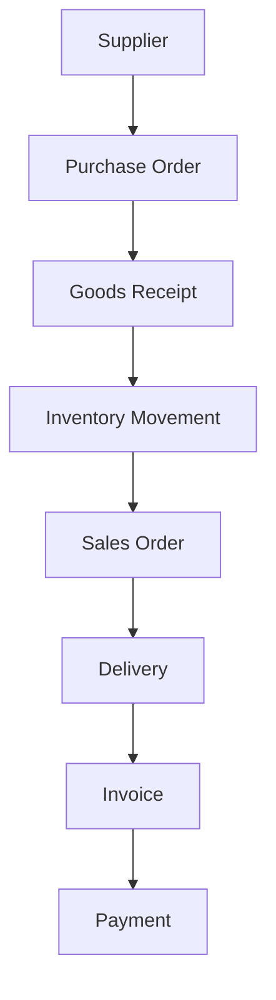
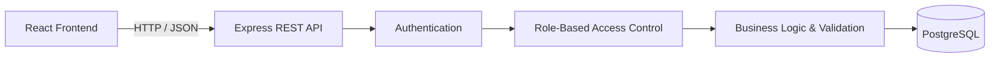

# Supply Flow: Supplier Management System


**Supply Flow** is a full-stack web-based Supplier Management System designed to centralize and digitize interconnected business operations including purchasing, inventory, sales, delivery, invoicing, and payments.

This project was developed as a portfolio project to demonstrate full-stack web development, relational database design, REST API integration, authentication, role-based access control, business workflow implementation, and automated backend testing.

---

## Project Overview

Many business operations are still managed using separate spreadsheets, documents, and manual records.

This approach can cause:

* Duplicate and inconsistent data
* Limited transaction traceability
* Repetitive manual data entry
* Difficulty monitoring stock movements
* Delays between departments
* Limited visibility into operational data

Supply Flow is designed to organize these processes within one integrated web application.

The system connects master data, purchasing, warehouse operations, sales, deliveries, invoices, and payments so each department can work with structured and interconnected information.

---

## Project Objectives

Supply Flow was developed with several main objectives:

* Centralize supplier, product, customer, and transaction data
* Connect purchasing, warehouse, sales, delivery, and finance workflows
* Reduce fragmented and repetitive manual data entry
* Improve inventory and transaction traceability
* Implement structured business process validation
* Control access based on user responsibilities
* Provide a foundation for operational dashboards and reporting

---

## Business Workflow



The workflow begins when products are ordered from suppliers through Purchase Orders.

Received products are recorded through Goods Receipts and generate inventory movements.

Available stock can then be processed through Sales Orders and Deliveries before continuing to Invoice and Payment management.

This creates an interconnected operational flow from procurement to financial settlement.

---

## Main Modules

### Authentication & User Management

* User authentication using JSON Web Token
* Protected application routes
* Role-based access control
* User account management
* Current-user profile
* Audit identity for selected business records

### Master Data

* Suppliers
* Product Categories
* Products
* Customers
* Users
* User Roles

### Purchasing

* Purchase Orders
* Purchase Order Items
* Purchase Order status transitions
* Expected receipt dates
* Goods Receipts
* Received quantity tracking

### Warehouse & Inventory

* Inventory Movements
* Stock-in records
* Stock-out records
* Goods receipt integration
* Transaction movement history
* Movement date and notes
* Audit information
* Low-stock data foundation

### Sales

* Customers
* Sales Orders
* Sales Order Items
* Sales Order status transitions
* Requested delivery dates

### Delivery

* Delivery records
* Delivery items
* Delivered quantity tracking
* Remaining quantity calculation
* Sales Order integration
* Delivery status management

### Finance

* Invoices
* Payments
* Invoice status tracking
* Payment status tracking
* Outstanding invoice data foundation

### Dashboard & Operational Data

* Role-based navigation
* Operational summary data
* Search
* Filtering
* Date-range filtering
* Pagination
* Responsive application interfaces

---

## User Roles

Supply Flow implements Role-Based Access Control to separate system responsibilities.

| Role         | Main Responsibility                                             |
| ------------ | --------------------------------------------------------------- |
| `ADMIN`      | Manages users, master data, and overall system access           |
| `PURCHASING` | Manages suppliers, products, and purchase orders                |
| `WAREHOUSE`  | Records goods receipts and monitors inventory movements         |
| `SALES`      | Manages customers, sales orders, and delivery-related processes |
| `FINANCE`    | Manages invoices and payments                                   |
| `MANAGER`    | Reviews operational information across business modules         |

Authorization is enforced by the backend based on the authenticated user's role.

---

## Key Features

* Full-stack web architecture
* RESTful API integration
* Relational PostgreSQL database
* JSON Web Token authentication
* Role-Based Access Control
* Protected backend endpoints
* CRUD operations across business modules
* Business process validation
* Transaction status transitions
* Search and filtering
* Date-range filtering
* Reusable pagination
* Audit identity
* Inventory movement tracking
* Remaining delivery quantity calculation
* Responsive dashboard interface
* Automated backend testing
* Separate database environment for automated tests

---

## System Architecture



### Frontend

The frontend is developed with React and communicates with the backend using REST APIs.

Reusable components are used for application forms, dialogs, pagination, navigation, and data management interfaces.

### Backend

The backend uses Node.js and Express.js.

The API layer handles:

* Routing
* Authentication
* Authorization
* Validation
* Business logic
* Database operations

### Database

PostgreSQL is used as the relational database for master data and interconnected business transactions.

The database implementation includes:

* UUID-based records
* Relational constraints
* PostgreSQL enums
* Database views
* Automatic timestamp triggers
* Transaction relationships

---

## Technology Stack

### Frontend

| Technology   | Usage                                      |
| ------------ | ------------------------------------------ |
| React        | User interface and reusable components     |
| Vite         | Frontend development and build environment |
| React Router | Application routing and protected pages    |
| Axios        | REST API communication                     |
| Lucide React | Interface icons                            |
| CSS          | Responsive layouts and application styling |

### Backend

| Technology          | Usage                                          |
| ------------------- | ---------------------------------------------- |
| Node.js             | Server-side runtime                            |
| Express.js          | REST API, routing, middleware, and controllers |
| JSON Web Token      | Authentication                                 |
| RBAC Middleware     | Role-based authorization                       |
| Node.js Test Runner | Automated backend testing                      |
| dotenv              | Environment-based configuration                |

### Database

| Technology       | Usage                                    |
| ---------------- | ---------------------------------------- |
| PostgreSQL       | Relational database                      |
| pgcrypto         | UUID generation                          |
| PostgreSQL Enums | Structured role and transaction statuses |
| Views            | Operational data summaries               |
| Triggers         | Automatic timestamp management           |

### Development Tools

* Visual Studio Code
* Git
* GitHub
* Postman
* pgAdmin
* npm

---

## Development Highlights

### Authentication & Authorization

The application implements JWT-based authentication and backend Role-Based Access Control.

Each authenticated user can only access operations allowed for their assigned role.

---

### Connected Business Transactions

Supply Flow is designed around interconnected transactions rather than isolated CRUD pages.

For example:

```text
Purchase Order
      ↓
Goods Receipt
      ↓
Inventory Movement
```

and:

```text
Sales Order
      ↓
Delivery
      ↓
Invoice
      ↓
Payment
```

This allows transaction data to follow the actual operational workflow.

---

### Inventory Traceability

Inventory records are connected with operational transactions to provide movement history for incoming and outgoing stock.

This creates a foundation for stock monitoring and inventory reporting.

---

### Business Status Validation

Transaction modules implement controlled status transitions to prevent invalid operational changes.

Examples include:

* Purchase Order workflow
* Sales Order workflow
* Delivery workflow
* Invoice and payment tracking

---

### Search, Filtering & Pagination

Data management interfaces support structured data exploration through:

* Keyword search
* Status filters
* Date-range filters
* Related-record filters
* Reusable pagination

---

### Automated Backend Testing

Backend testing is implemented for authentication and selected core business workflows.

Testing covers areas such as:

* Authentication
* Authorization
* Role access
* Business validations
* Data filtering
* Transaction workflows
* Purchasing processes
* Inventory
* Sales
* Deliveries
* Invoices
* Payments

A separate PostgreSQL database is used for automated testing to isolate test data from development data.

---

<!-- ## Screenshots

Application screenshots will be added as the frontend development progresses. -->

<!--

Example screenshot structure:

### Dashboard


### Purchase Order Management


### Inventory Management


### Sales Order Management


### Delivery Management


-->

<!-- ---

## Development Status

| Area                                  | Status            |
| ------------------------------------- | ----------------- |
| Database schema & relationships       | ✅ Implemented     |
| Backend REST API                      | ✅ MVP Implemented |
| Authentication                        | ✅ Implemented     |
| Role-Based Access Control             | ✅ Implemented     |
| Core business modules                 | ✅ Implemented     |
| Automated backend testing             | ✅ Implemented     |
| Frontend core modules                 | 🚧 In Development |
| Dashboard integration                 | 🚧 In Development |
| Complete frontend-backend integration | 🚧 In Development |
| Screenshots & project documentation   | 🚧 In Progress    |
| Production deployment                 | 📌 Planned        |
| Public live demo                      | 📌 Planned        |

Supply Flow is actively being developed and improved as additional frontend workflows and system integrations are completed. -->

---

## Project Scope

Supply Flow currently includes the following interconnected business areas:

```text
Master Data
   │
   ├── Suppliers
   ├── Categories
   ├── Products
   └── Customers
   │
   ▼
Purchasing
   │
   ├── Purchase Orders
   └── Goods Receipts
   │
   ▼
Inventory
   │
   └── Inventory Movements
   │
   ▼
Sales
   │
   └── Sales Orders
   │
   ▼
Delivery
   │
   └── Deliveries
   │
   ▼
Finance
   │
   ├── Invoices
   └── Payments
```

<!-- ---

## Project Notice

This repository is published as a **personal portfolio and learning project** to demonstrate full-stack web development, system architecture, database design, REST API integration, authentication, authorization, business workflow implementation, and software testing.

The source code is provided for portfolio demonstration purposes and is **not presented as a reusable commercial template**.

This project is currently under active development and is not yet intended for production use. -->

---

## Author

**Zaki Oktaviani**

Full-Stack Web Development & UI/UX Design

* Portfolio: [zakiokta.my.id](https://zakiokta.my.id)
<!-- * GitHub: [Zakiii14](https://github.com/Zakiii14) -->

---

> **Supply Flow** || Building an integrated digital workflow from procurement to payment.
